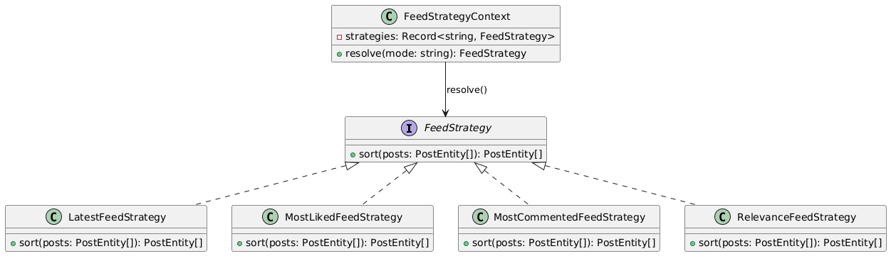
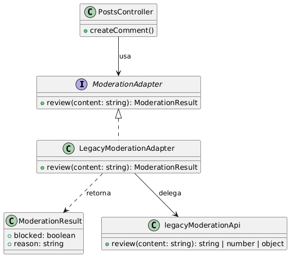
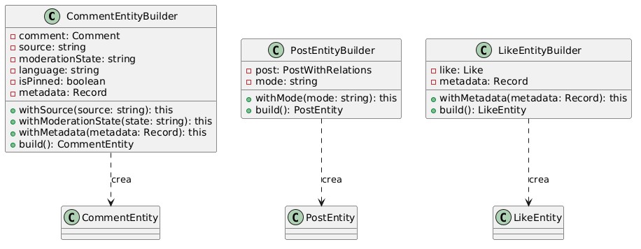

# AC_05 — Patrones de diseño aplicados

## Contexto
El proyecto implementa una API REST en NestJS para un feed social con posts, likes y comentarios.  
Si bien el sistema **funciona correctamente**, el código del servidor presentaba problemas de diseño que lo hacían frágil ante cambios y difícil de mantener:

- Lógica de negocio mezclada con infraestructura en el controlador.
- Dependencia directa de una API legada con contratos de tipo inconsistentes.
- Construcción de entidades duplicada y dispersa en múltiples lugares.

Se aplicaron tres patrones de diseño (uno por cada categoría vista en clases) para resolver cada problema de forma específica.

---

## Patrón 1 — Strategy (comportamental)

### Problema identificado

El endpoint `GET /api/posts/feed` contenía un bloque `switch` directamente en el controlador para ordenar los posts según el `mode` recibido:

```typescript
// posts.controller.ts (original) 
switch (mode) {
    case "latest":
        sorted = sorted.sort((a, b) => b.createdAt.getTime() - a.createdAt.getTime())
        break
    case "mostLiked":
        sorted = sorted.sort((a, b) => b.likesCount - a.likesCount)
        break
    // ...
}
```

Agregar un nuevo modo de ordenamiento requería modificar el controlador, violando el principio Open/Closed. Además, la lógica de ordenamiento era imposible de testear de forma aislada.

### Solución aplicada

Se extrajeron los algoritmos de ordenamiento en clases independientes que implementan una interfaz común `FeedStrategy`. Un `FeedStrategyContext` actúa como contexto que resuelve y delega la estrategia correcta en tiempo de ejecución.

```
src/posts/strategies/
  ├── feed.strategy.ts          ← interfaz FeedStrategy + 4 implementaciones
  └── feed-strategy.context.ts  ← contexto que resuelve la estrategia por modo
```

```typescript
// feed.strategy.ts
export interface FeedStrategy {
    sort(posts: PostEntity[]): PostEntity[]
}

export class MostLikedFeedStrategy implements FeedStrategy {
    sort(posts: PostEntity[]): PostEntity[] {
        return [...posts].sort((a, b) => b.likesCount - a.likesCount)
    }
}
```

```typescript
// posts.controller.ts (refactorizado)
const strategy = this.feedStrategyContext.resolve(mode)
const sorted = strategy.sort(mappedPosts)
```

Para agregar un nuevo modo (por ejemplo `trending`) basta con crear una nueva clase sin tocar el controlador ni el contexto.

### Diagrama

---

## Patrón 2 — Adapter (estructural)

### Problema identificado

`legacyModerationApi.review()` devuelve tipos incompatibles dependiendo del caso: `"BLOCK"`, `"OK"`, un `number`, o un `object` con `{ pass: boolean, reason: string }`. El controlador tenía que lidiar con esta inconsistencia directamente mediante un bloque `if/else if` frágil:

```typescript
// posts.controller.ts (original)
const moderation = legacyModerationApi.review(body.content)

let blocked = false

if (moderation === "BLOCK") {
    blocked = true
} else if (typeof moderation === "number") {
    blocked = moderation < 1
} else if (typeof moderation === "object") {
    blocked = !("pass" in moderation && moderation.pass)
} else if (moderation === "OK") {
    blocked = false
}
```

Esto acopla el controlador a los detalles de implementación del cliente legacy. Un cambio en la API externa rompería múltiples puntos del código.

### Solución aplicada

Se creó `LegacyModerationAdapter` que implementa una interfaz `ModerationAdapter` con un método `review()` que siempre retorna `{ blocked: boolean, reason: string }`. El controlador solo conoce esta interfaz limpia.

```
src/posts/adapters/
  └── moderation.adapter.ts  ← LegacyModerationAdapter + interfaz ModerationResult
```

```typescript
// moderation.adapter.ts
export interface ModerationResult {
    blocked: boolean
    reason: string
}

@Injectable()
export class LegacyModerationAdapter implements ModerationAdapter {
    review(content: string): ModerationResult {
        const raw = legacyModerationApi.review(content)
        if (raw === "BLOCK") return { blocked: true, reason: "blocked-by-legacy" }
        if (typeof raw === "number") return { blocked: raw < 1, reason: ... }
        // ...
    }
}
```

```typescript
// posts.controller.ts (refactorizado)
const moderation = this.moderationAdapter.review(body.content)
if (moderation.blocked) throw new BadRequestException("Comment blocked by moderation")
```

### Diagrama




---

## Patrón 3 — Builder (creacional)

### Problema identificado

La construcción de `PostEntity`, `CommentEntity` y `LikeEntity` estaba duplicada en el controlador con valores hardcodeados dispersos. Por ejemplo, `CommentEntity` se instanciaba en dos lugares del mismo archivo con parámetros distintos y valores mágicos:

```typescript
// posts.controller.ts (original) — getComments
new CommentEntity(comment.id, comment.postId, comment.content,
    comment.createdAt, comment.updatedAt, comment.source,
    "approved",                          // ← hardcodeado
    comment.content.length > 80 ? 70 : 45, // ← lógica inline
    comment.content.length % 2 === 0,    // ← lógica inline
    "es",                                // ← hardcodeado
    { chars: comment.content.length, source: comment.source })

// posts.controller.ts (original) — createComment
new CommentEntity(created.id, created.postId, created.content,
    created.createdAt, created.updatedAt, created.source,
    "approved",
    created.content.length > 60 ? 80 : 40, // ← valores distintos al anterior
    false,
    "es",
    { moderation, source: "legacy" })
```

Los constructores de 11-14 parámetros son propensos a errores de posición y dificultan entender qué rol cumple cada valor.

### Solución aplicada

Se creó un builder por cada entidad. Cada builder expone métodos con nombre descriptivo (`.withMode()`, `.withSource()`, `.withMetadata()`) y centraliza los valores por defecto y la lógica derivada.

```
src/posts/builders/
  ├── post-entity.builder.ts     ← PostEntityBuilder
  ├── comment-entity.builder.ts  ← CommentEntityBuilder
  └── like-entity.builder.ts     ← LikeEntityBuilder
```

```typescript
// comment-entity.builder.ts
export class CommentEntityBuilder {
    constructor(private readonly comment: Comment) {}

    withSource(source: string): this { ... }
    withModerationState(state: string): this { ... }
    withMetadata(metadata: Record<string, unknown>): this { ... }

    build(): CommentEntity { /* centraliza toda la lógica derivada */ }
}
```

```typescript
// posts.controller.ts (refactorizado) — mismo resultado, sin duplicación
const entity = new CommentEntityBuilder(created)
    .withSource(created.source)
    .withModerationState("approved")
    .withMetadata({ moderation: moderation.reason, source: "legacy" })
    .build()
```

### Diagrama



---

## Archivos modificados / creados

| Archivo | Acción | Descripción |
|---|---|---|
| `src/posts/strategies/feed.strategy.ts` | Nuevo | Interfaz `FeedStrategy` y 4 implementaciones |
| `src/posts/strategies/feed-strategy.context.ts` | Nuevo | Contexto que resuelve la estrategia por modo |
| `src/posts/adapters/moderation.adapter.ts` | Nuevo | Adapter sobre el cliente legacy de moderación |
| `src/posts/builders/post-entity.builder.ts` | Nuevo | Builder para `PostEntity` |
| `src/posts/builders/comment-entity.builder.ts` | Nuevo | Builder para `CommentEntity` |
| `src/posts/builders/like-entity.builder.ts` | Nuevo | Builder para `LikeEntity` |
| `src/posts/posts.controller.ts` | Modificado | Usa los tres patrones; elimina lógica inline |
| `src/posts/posts.module.ts` | Modificado | Registra `LegacyModerationAdapter` y `FeedStrategyContext` como providers |
